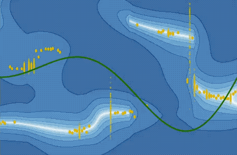

LEO: Learning energy based models in graph optimization
===================================================

This repository contains the source code of the paper [LEO: Learning Energy-based Models in Factor Graph optimization](https://arxiv.org/abs/2108.02274).

# Content

The code contains three sets of experiments:
```
1. 1D energy-based regression: Learn E(x,y) where x is 1D input and y is 1D output
2. 2D synthetic navigation: Learn E(x,z) where x is a sequence of 2D robot poses and z is a sequence of GPS and odometry measurements.
3. 2D real-world pushing: Learn E(x,z) where x is a sequence of 2D object poses and z is a sequence of tactile measurements.
```
# Installation

Create a virtual python environment using [Anaconda](https://www.anaconda.com/products/individual):
```
conda create -n leo python=3.7
conda activate leo
```

Install the `leopy` python package locally. In the `leopy/` dir execute:
```
pip install -e .
```

Any additional install requirements are detailed within each example.
# Usage 
## Example 1: 1D energy-based regression

We borrow this example from [The Differentiable Cross-Entropy Method](https://github.com/facebookresearch/dcem/) repository. We extend the example by adding in energy-based learning method (LEO), unrolling Gauss-Newton method and additional preprocessing and visualization utilities.

To run the regression example, execute in the `leopy/` dir:
```
python scripts/examples/regression.py
```

By default, this runs LEO with Gauss-Newton as the inner loop optimizer. To run the example with other algorithms and settings, please take a look at [regression.yaml](leopy/config/examples/regression.yaml). For instance, to run unrolled Gauss-Newton, set `model=${unroll_gn}`. To run LEO with cross-entropy method as the inner loop optimizer, set `model=${leo_cem}`.

Upon running the script, you should see the energy function E(x,y) being visualized as it is updated each iteration: 



(green is the groundtruth function, orange are the LEO samples, lighter colors correspond to lower energy)

<br />

## Example 2: 2D synthetic navigation

To run the navigation examples, we first need to install [gtsam](https://github.com/borglab/gtsam). Start by cloning the gtsam repository:
```
git clone https://github.com/borglab/gtsam.git
git checkout tags/4.0.0
```

Build and install the gtsam library:
```
cmake -DGTSAM_INSTALL_CYTHON_TOOLBOX=ON -DGTSAM_PYTHON_VERSION=3.7 ..
make -j
make install
```
If doing a local install, additionally pass in the install path `-DCMAKE_INSTALL_PREFIX=../install`.

Download the 2D navigation datasets locally by running:
```
./download_local_files.sh
```

To run the 2D navigation example:
```
python scripts/examples/nav2d.py
```
By default, this runs LEO with [iSAM2](https://www.cs.cmu.edu/~kaess/pub/Kaess12ijrr.pdf) optimizer in the inner loop on the varying covariance dataset. To run the example with other datasets and settings, please take a look at [leo_nav2d.yaml](leopy/config/examples/leo_nav2d.yaml).

Upon running the script, you should see the optimized robot trajectories being saved to `local/plots` every learning iteration:


<br />

# Citing
If you find this repository helpful in your publications, please consider citing the following:

```
@inproceedings{sodhi2021leo,
  title={{LEO: Learning energy-based models in factor graph optimization}},
  author={Sodhi, Paloma and Dexheimer, Eric and Mukadam, Mustafa and Anderson, Stuart and Kaess, Michael},
  booktitle={Conference on Robot Learning (CoRL)},
  year={2021}
}
```

# License
This repository is licensed under the [MIT License](LICENSE.md). 